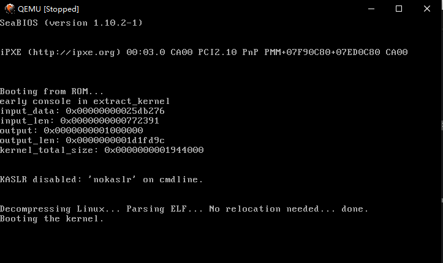

# OSH Lab 1 Report
* 姓名：黄子昂 

* 学号：PB16001840 

* 实验名称：调试操作系统的启动过程 

## 实验环境

本次实验的运行环境为：
- wsl debian
- qemu 2.8.1
- busybox 1.28.2
- GNU gdb (Debian 7.12-6) 7.12.0.20161007-git

## 实验步骤

#### 编译内核

首先编译内核，从官网下载linux-4.15.13的内核压缩包，并解压，cd命令进入解压后的文件夹，由于wsl版比较精简，在编译过程中经常由于缺环境导致退出，所以在编译之前一次性安装好相应的环境。

```bash
apt-get install -y chrpath gawk texinfo libsdl1.2-dev whiptail diffstat cpio libssl-dev

```

然后解压内核的压缩包，执行编译。

```bash
make clean
make menuconfig
make
```
由于需要调试，所以在`make menuconfig`这里，需要勾选上`Compile the kernel with debug info`，勾上后按save保存，由于我之前未保存直接退出导致编译后调试文件不可用。


#### 安装qemu

这里直接用apt自动安装
```bash
apt-get install qemu
```

刚开始实验时运行qemu一直无法运行并提示
```bash
Could not initialize SDL(No available video device) - exiting
```
这是由于使用qemu需要窗口环境，所以安装`VcXsrv`，并在wsl上安装需要的库
```bash
sudo apt-get install x11-apps libsdl2-dev
```
然后修改环境变量以使qemu运行在0：0 server的窗口中我们需要添加一个环境变量
```bash
echo export DISPLAY=:0.0>>~/.bashrc86_64
```

比较不方便的是打开被冻结的qemu窗口后鼠标自动会被grab，需要按住ctrl和alt才能将鼠标移出窗口，且放开两键之一鼠标又会被grab，查阅官方文档，使用Xlaunch启动VcXsrv时,增加一个参数`-ignoreinput`，代表忽略键鼠的input，由于调试过程中不需要用到对qemu黄口的操作，所以使用这个参数符合要求。


#### 安装busybox

获取busybox 1.28.2安装包，解压并进入解压后的文件夹，使用如下指令编译
```bash
make menuconfig
make
make install
```
其中安装时勾选`Build static binary (no shared libs)`,然后搭建文件系统

```bash
cd _install
mkdir proc sys dev etc etc/init.d
touch _install/etc/init.d/rcS
```
nano编辑`rcS`文件的内容，这是启动脚本，挂载文件系统用
```bash
#!/bin/sh
mount -t proc none /proc
mount -t sysfs none /sys
/sbin/mdev -s
```
将此脚本加权限变为可执行文件，然后创建系统镜像文件,并移到linux-4.15.13文件夹下

```bash
chmod +x _install/etc/init.d/rcS
cd _install
find . | cpio -o --format=newc > ../rootfs.img
cd ..
mv rootfs.img ~/linux-4.15.13/rootfs.img
```

### 到此为止，搭建完调试环境

## 使用gdb追踪内核启动过程

```bash
cd ~/linux-4.15.13
qemu-system-x86_64 -kernel ./arch/x86_64/boot/bzImage -initrd rootfs.img -append "console=tty1 root=/dev/ram rdinit=/sbin/init" -S -s -append "nokaslr"
```
此时qemu窗口被冻结


然后另开一个窗口，打开gdb -tui
```bash
file vmlinux
target remote:1234
break start_kernel
c
```
此时暂停在了启动内核的函数



根据[参考资料](https://www.cnblogs.com/codecc/p/boot.html)中写的：
>Kernel会以只读方式挂载根文件系统，当根文件系统被挂载后，开始装载第一个进程(用户空间的进程)，执行/sbin/init，之后就将控制权交接给了init程序。

观查这个函数内部的函数名，可知大部分的初始化内容都在这个函数内部的子函数中完成:


这里挑几个能看懂的函数进行追踪分析。

### `local_irq_disable`
在开头部分525，526行有这两行代码:
```c
local_irq_disable();                                                   
early_boot_irqs_disabled = true;
```
而在结尾部分(631,632行)有
```c
early_boot_irqs_disabled=false;                                           
local_irq_enable();
```
说明为了内核初始化顺利，需要屏蔽IRQ信号（如键盘输入），防止cpu中断打断内核的初始化。具体实现时通过汇编代码实现：
```c
#define local_irq_disable() __asm__ __volatile__("cli": : :"memory")  
#define local_irq_enable()  __asm__ __volatile__("sti": : :"memory")  
```
就是调用了cli与sti两个cpu指令来实现是否开启中断。

### `boot_cpu_init`

用断点之后list查看源码，如下图

可以看到这个函数激活CPU，初始启动cpu，并用一个int存储返回的cpu id，然后根据id调用四个函数将CPU标记为online, active, present, possible,这里查阅资料知，kernel cpu control将CPU core抽象为possible、present、online和active四种状态，刚好与这里相对应。


### `setup_arch`
从名字上看这个函数用于体系结构的初始化，接受一个command_line作为参数

比较长，内容较杂，并且网上资料的版本较老，所以不是很看明白。

### `trap_init`
这是中断的初始化


查看这些注释，反复提到IST和IDT，通过搜索得知IDT是中断描述符表（`Interrupt Descriptor Table`）缩写,这个表即是在保护模式下，表项扩为8字节的中断向量表，x86中普遍使用IDT。首先设置cpu entry areas，然后设置IDT的初始化，IST应该是指Interrupt Service Threads（这个是msdn上查来的，百度上查到的中断服务表太诡异了，而且Google上找不到相应的内容），然后执行对其的init。

（其他很多部件的init这里就跳过了)
## rest_init
在内核各个部件初始化后在main函数最后调用rest_init函数。

这里也只挑一部分进行分析。
### `kernel_thread`

```c
pid = kernel_thread(kernel_init, NULL, CLONE_FS);
```
根据注释这个进程就是pid 1的init进程，是linux中的一个特殊进程，在下面有一个类似的函数调用，那里创建了pid为2的kthreadd，kernel_thread函数的源码即是简单地调用函数fork一个进程然后再把pid返回。


可以具体看一下kernel init的函数内容，这个函数就在`init/main.c`中，具体是进行更高阶的初始化工作，具体干的事情很多，比如清除一部分初始化程序占用的内存，比如`try_to_run_init_process("/sbin/init")`，而众所周知`/sbin/init`是第一个用户进程。

###  `schedule_preempt_disabled`
这个函数在初始化特殊的进程之后，调用schedule()进行进程调度，使核心进程能够顺利进行。

其源代码如下,在中间调用了schedule()。
```c
void __sched schedule_preempt_disabled(void)
{
    sched_preempt_enable_no_resched();  
    schedule();
    preempt_disable();  
}
```

### `cpu_idle_loop`
可以看到rest_init()在最后会调用cpu_idle_loop()，这个函数在`kernel/sched/idle.c`中，并且是一个死循环，然后这就成为了pid 0的`idle process`，这个进程优先级是最低的，在cpu空闲时才会运行它。

## 实验小结
这次实验可以说在配置实验环境上是相当麻烦了，光是内核就完整编译了三次（无比漫长的等待），还有wsl下各种缺库，而且运行独立的窗口还需要特别的环境，查了不少的资料。
但这还是很有必要的，绕过弯路之后在未来碰到同样的问题时便会轻松很多，之后的实验会有更复杂的内容，熟悉这些基本工具还是很有必要的，比如gdb和qemu，而且这次实验后环境包装了不少，以后安装软件就没这么麻烦了。
